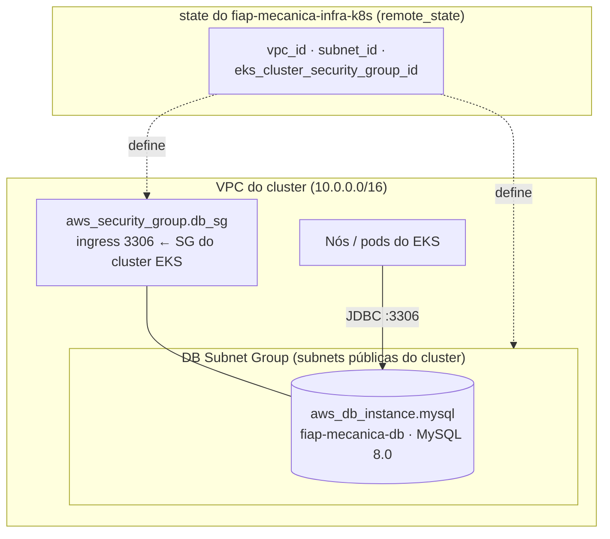

# Infraestrutura de Banco de Dados — fiap-mecanica-infra-db (Terraform)

## Propósito

Provisiona o **banco de dados gerenciado** da aplicação [Mecânica FIAP](https://github.com/ArthurPeruzzo/fiap-mecanica): uma instância **Amazon RDS for MySQL**, seu subnet group e o security group que a protege.

Um dos **4 repositórios** da Fase 3 (Aplicação, Infra Kubernetes, Infra de Banco — este —, Lambda). Não cria rede própria: reaproveita a VPC/subnets do cluster, lidas do repositório `fiap-mecanica-infra-k8s`.

## Tecnologias

- **Terraform** (backend S3 com lock nativo `use_lockfile`; `required_version >= 1.10`)
- **AWS**: RDS for MySQL 8.0 (`db.t3.micro`, 20 GB gp2, criptografado, `publicly_accessible = false`), DB Subnet Group, Security Group
- **`terraform_remote_state`** — leitura somente-leitura do state do `fiap-mecanica-infra-k8s`
- **GitHub Actions** (CI/CD)

## Arquitetura



O RDS só aceita conexões na porta 3306 vindas do **security group do control plane do EKS** — ou seja, dos pods da aplicação. Não é acessível pela internet.

## Recursos criados

| Arquivo | Recurso | O que é |
|---|---|---|
| `database.tf` | `aws_db_subnet_group.db_subnet_group` | Subnet group nas subnets públicas do cluster (lidas via remote state) |
| `database.tf` | `aws_security_group.db_sg` | Libera a porta 3306 só para o SG do cluster EKS |
| `database.tf` | `aws_db_instance.mysql` | RDS MySQL 8.0 privado, criptografado, `skip_final_snapshot = true` |
| `data.tf` | `data.terraform_remote_state.k8s` | Leitura do state do `fiap-mecanica-infra-k8s` (`tfstate/terraform.tfstate`) |

## Dependência do `fiap-mecanica-infra-k8s`

Lê `vpc_id`, `subnet_id` e `eks_cluster_security_group_id` via `data.terraform_remote_state.k8s` — mesmo bucket S3, chave `tfstate/terraform.tfstate`, somente leitura. Consequência: **o CD daquele repositório precisa ter rodado com sucesso antes do primeiro CD deste**; numa conta zerada, sem isso o `terraform plan` falha tentando ler uma chave de state que ainda não existe.

## Variáveis (`vars.tf`)

| Variável | Default | Descrição |
|---|---|---|
| `project_name` | `fiap-mecanica` | Prefixo do nome dos recursos |
| `region_default` | `us-east-1` | Região AWS |
| `tags` | `{Name = "fiap-mecanica-terraform"}` | Tags aplicadas aos recursos |
| `db_name` | `mecanica` | Nome do banco criado no RDS |
| `db_instance_class` | `db.t3.micro` | Classe da instância RDS |
| `db_username` | — (obrigatório, sensível) | Usuário master do RDS |
| `db_password` | — (obrigatório, sensível) | Senha master do RDS |

## Outputs (`output.tf`)

| Output | Consumido por |
|---|---|
| `db_endpoint` | `app-infra` do repositório `fiap-mecanica` (via `terraform_remote_state`) — monta o `DB_URL` do ConfigMap da aplicação |
| `db_name` | Nome do banco (`mecanica`) |

## Execução e deploy

### Automático (CI/CD)

- **`ci.yml`** (Pull Request): `terraform plan`.
- **`cd.yml`** (push na `main`): garante o bucket do backend → `terraform apply` → publica o `db_endpoint` no resumo da run.

Branch `main` protegida — merge só via Pull Request.

**Secrets:** `AWS_ACCESS_KEY_ID`, `AWS_SECRET_ACCESS_KEY`, `AWS_SESSION_TOKEN` (sessão da Academy Lab) e `TF_VAR_DB_USERNAME` / `TF_VAR_DB_PASSWORD` — o **mesmo par** usado no repositório `fiap-mecanica` (que precisa dele para montar o Secret Kubernetes com que a aplicação conecta no banco). Se divergirem, a aplicação não autentica no RDS.

### Manual

```bash
terraform init
TF_VAR_db_username=<usuario> TF_VAR_db_password=<senha> terraform apply
```

> ⚠️ `db_password` é aplicada como senha master do RDS. Rodar `apply` com um valor errado **rotaciona a senha do banco**. Garanta que o valor bate com o `TF_VAR_DB_PASSWORD` do repositório `fiap-mecanica`.

## Ordem de deploy numa infra do zero

```
1º  fiap-mecanica-infra-k8s   (este repositório lê o state dele)
2º  fiap-mecanica-infra-db    (este)
3º  fiap-mecanica-lambda      (independente)
4º  fiap-mecanica             (app-infra lê o state deste)
```

## Documentação da API

Este repositório não expõe APIs. A documentação (Swagger) e a coleção de endpoints estão no repositório da aplicação: [fiap-mecanica](https://github.com/ArthurPeruzzo/fiap-mecanica#documentação-da-api).
